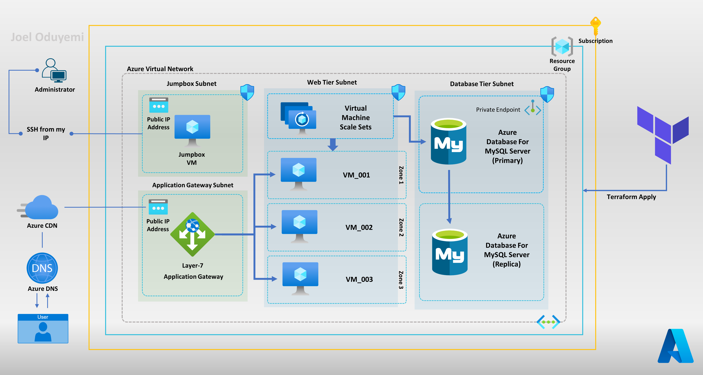

# Project Name

This project is a Terraform configuration for deploying a resilient and scalable 2-Tier Architecture in Azure.

## Prerequisites

Before you can use this project, you will need to have the following installed:

- Terraform
- Azure CLI

You will also need to have an Azure subscription and an Azure storage account for storing the Terraform state.

## Architecture



## Getting Started

To get started with this project, follow these steps:

1. Clone the repository to your local machine.
2. Configure the `remote-state.sh` script with the appropriate values for the already defined variables.
3. Run the `remote-state.sh` script to create the storage account and container for storing the Terraform state.
4. Configure the `backend.tf` file with the appropriate values for the Azure Storage account, Container and Resource Group used in the script previously.
5. Initialize Terraform by running `terraform init`.
6. Create a `terraform.tfvar` file to define default values for the variables used in the terraform config.

``` bash
# terraform.tfvars template

resource_group_name        = "" // Name of the resource group to deploy the resources to
location                   = "" // Azure region to deploy the resources to
vnet_address_space         = "" // CIDR Address space for the virtual network
app_gateway_subnet         = "" // CIDR Address space for the application gateway subnet
jumpbox_subnet             = "" // CIDR Address space for the jumpbox subnet
web_tier_subnet            = "" // CIDR Address space for the web tier subnet
database_subnet            = "" // CIDR Address space for the database subnet
vm_name                    = "" // Name of the Jumpbox virtual machine
vmss_name                  = "" // Name of the Web Tier virtual machine scale set
admin_username             = "" // Username for the virtual machines
admin_password             = "" // Password for the Database Server
app_gateway_name           = "" // Name of the Application Gateway
kv_name                    = "" // Name of the Key Vault
cdn_profile_name           = "" // Name of the CDN Profile
cdn_endpoint_name          = "" // Name of the CDN Endpoint
database_name              = "" // Name of the MySQL Database
private_dns_zone_name      = "" // Name of the Private DNS Zone to create "example.mysql.database.azure.com"
private_dns_zone_link_name = "" // Name of the Private DNS Zone Link to create 

```
7. Review the resources that will be created by running `terraform plan`.
8. Deploy the resources by running `terraform apply --auto-approve`.

## Resources

This project deploys the following resources:

- `azurerm_resource_group`
- `azurerm_virtual_network`
- `azurerm_subnet`
- `azurerm_network_security_group`
- `azurerm_linux_virtual_machine`
- `azurerm_linux_virtual_machine_scale_set`
- `azurerm_application_gateway`
- `azurerm_key_vault`
- `azurerm_cdn_profile`
- `azurerm_cdn_endpoint`

Note that the actual resources deployed by the project will be shown when you run `terraform plan`.

## Contributing

If you would like to contribute to this project, please fork the repository and submit a pull request.